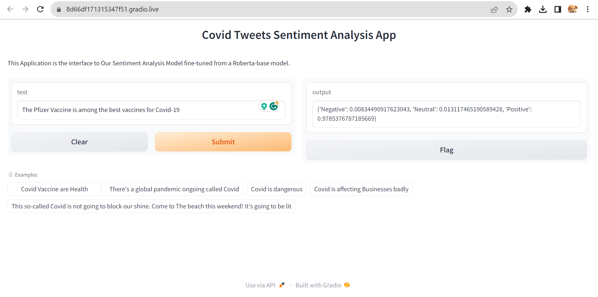

Author 
## Project Title
####  Sentiment Analysis Project

##### *Introduction*
 
In this project, we fine-tuned pre-trained Deep Learning Models such as the Roberta- -base model, and the distilbert-base-uncased Model from Hugging face on a new dataset (data) to adapt the models to the task that we wanted to solve such as the prediction of sentiment expressed in a Tweet. Then we created the Gradio app to use the models and deploy the app on the Hugging Face Platform.

###### *Objectives of The Project*

The objective of this project was:
- fine-tuning pre-trained models.
- Embedding fine-tuned Hugging Face models into Gradio App
- Hosting models on the Hugging Face platform.
- Deploying App on Hugging Face platform.

###### Features
**Sentiment Classification**: The model classifies text into positive, negative, or neutral sentiment.

**Easy-to-Use**: Simple API for performing sentiment analysis on custom text inputs.
**Model Accuracy**: Trained on a comprehensive dataset for accurate sentiment predictions.

#### Models Details

**Training ACCuracy**
the Training accuracies for Distilbert_base_uncases Model took:

**Model weights**

Check out the configuration reference at https://huggingface.co/docs/hub/spaces-config-reference
project link 

**App Screen Short**

**Deployment app Link**

